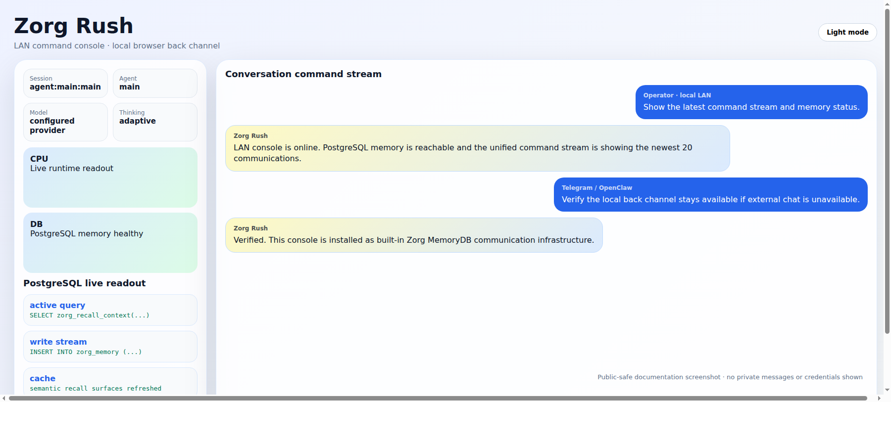
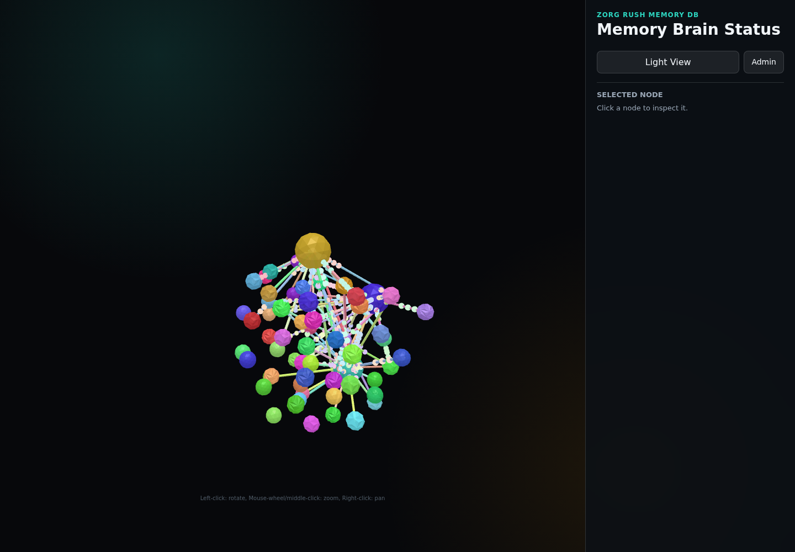

# Zorg MemoryDB OpenClaw Build

Zorg MemoryDB is an additive OpenClaw overlay with DB-backed memory integrated directly into the normal OpenClaw home and workspace layout.

The install flow follows OpenClaw's own git-checkout install path. Start from the original upstream `openclaw/openclaw` repository, create a Zorg MemoryDB branch or fork of that repository, and install OpenClaw from that same checkout. Zorg MemoryDB files live in the OpenClaw source tree and runtime workspace, not in a second `Zorg_MemoryDB` application folder. A fresh install should feel like starting OpenClaw from scratch: run the same public installer in git mode, open OpenClaw, and get the normal startup behavior after DB-backed recall has been wired and verified. The database is an internal implementation detail, stored inside OpenClaw's own folders, and should not require separate setup or user-facing credentials.

The public repository is sanitized. It includes structure, scripts, schema, docs, and templates only — no private rows, transcripts, account data, or operator context.


## Base-install permanent engineering rules

System changes, code writing, and software changes are governed by permanent base-install rules, not personal operator preferences. They are documented in [`docs/base-install-permanent-engineering-rules.md`](docs/base-install-permanent-engineering-rules.md), included in clean-install templates, and synchronized into structured DB recall.

Zorg MemoryDB is packaged as an add-on overlay to upstream OpenClaw. Overlay installs and upgrades must preserve existing OpenClaw behavior/user data unless an explicit migration documents otherwise. Keep Zorg-specific docs, DB scripts, templates, and LAN command chat files under the overlay path so upstream OpenClaw updates do not overwrite them.

## Why Zorg MemoryDB?

Zorg MemoryDB is the OpenClaw base with a durable PostgreSQL-backed memory spine, structured operating rules, privacy-aware communication filters, adaptive recovery patterns, automatic DB-only recall repair, private/off-host backup guidance, and public-safe templates. It is designed as a clean add-on layer so you can keep the upside of upstream OpenClaw while gaining operational continuity.

- Why install Zorg MemoryDB over plain OpenClaw? [`docs/why-zorg-memorydb.md`](docs/why-zorg-memorydb.md)
- Before you get started: [`docs/before-you-get-started.md`](docs/before-you-get-started.md)
- Recommended baseline for a fully useful assistant install: [`docs/base-setup.md`](docs/base-setup.md)
- Dynamic trigger backpressure: [`docs/dynamic-trigger-backpressure.md`](docs/dynamic-trigger-backpressure.md)
- Built-in LAN/local command console: [`docs/lan-console.md`](docs/lan-console.md)
- Built-in 3D brain map for MemoryDB: [`docs/zorg-memory-3d.md`](docs/zorg-memory-3d.md)





## Before you get started

Install OpenClaw from a Zorg MemoryDB branch of the original OpenClaw repository. Do not treat Zorg MemoryDB as a separate application stack, a replacement OpenClaw distribution, or a second assistant folder.

Before installing, collect the model-provider API key, messaging token, email OAuth/app credentials, GitHub/private-backup access, and hosting details for the OpenClaw install you plan to use. See [`docs/before-you-get-started.md`](docs/before-you-get-started.md).

## Install OpenClaw From the Zorg Branch

Use OpenClaw's official git install mode. The branch must be made from `openclaw/openclaw`, then Zorg MemoryDB changes are committed into that branch.

Create or update the branch:

```bash
git clone https://github.com/openclaw/openclaw.git "$HOME/openclaw"
cd "$HOME/openclaw"
git checkout -b zorg-memorydb origin/main
```

After the Zorg MemoryDB changes are in that same OpenClaw checkout, install from it:

```bash
curl -fsSL https://openclaw.ai/install.sh | bash -s -- --install-method git --git-dir "$HOME/openclaw" --version zorg-memorydb --no-onboard
```

For a published fork, clone the fork into the same OpenClaw checkout folder first:

```bash
git clone https://github.com/<your-account>/openclaw.git "$HOME/openclaw"
cd "$HOME/openclaw"
git checkout zorg-memorydb
curl -fsSL https://openclaw.ai/install.sh | bash -s -- --install-method git --git-dir "$HOME/openclaw" --version zorg-memorydb --no-onboard
```

OpenClaw's installer also supports `OPENCLAW_INSTALL_METHOD=git`, `OPENCLAW_GIT_DIR=<path>`, and `OPENCLAW_GIT_UPDATE=0|1`. The important rule is that the checkout is OpenClaw itself.

## Runtime Workspace

OpenClaw's runtime home and workspace stay in the normal OpenClaw location, usually `~/.openclaw` and `~/.openclaw/workspace`. Zorg MemoryDB runtime files and database configuration must be placed there by the branch install, not under `~/.openclaw/workspace/Zorg_MemoryDB` or `~/Zorg_MemoryDB`.

Verify OpenClaw after installing from the branch:

```bash
openclaw --version
openclaw doctor
openclaw gateway status
```

The target state is still a normal OpenClaw install: `openclaw gateway status`, `openclaw doctor`, and `openclaw tui` remain the user-facing OpenClaw controls.

## Recommended base setup

A fully useful OpenClaw + Zorg MemoryDB install should have more than the memory layer alone:

- the built-in LAN/local command chat for private local access to the agent without an outside chat provider
- the built-in Zorg Memory 3D brain map for visualizing MemoryDB relationships, recall hints, semantic links, runtime activity, and ADMIN-tunable graph settings
- an optional fast instant messaging control channel such as Telegram, WhatsApp, Signal, Discord, or Slack for remote/mobile convenience
- a dedicated assistant email account used as the public-facing executive-assistant identity, so routine mail is filtered through the agent instead of the operator's private address
- optional, separately governed access to the operator's personal email for triage/search/drafting
- a private GitHub repo or other private off-host target for PostgreSQL memory backups
- a Cloudflare Tunnel/connector so Zorg can publish operator-approved web URLs without exposing origin services directly

See [`docs/base-setup.md`](docs/base-setup.md).

## Verify Zorg MemoryDB

After applying the overlay, verify both OpenClaw and DB-backed recall from the OpenClaw workspace:

```bash
openclaw doctor
openclaw gateway status
cd ~/.openclaw/workspace
.venv-sqlmem/bin/python memory_sql_tool.py tables
.venv-sqlmem/bin/python memory_recall_router.py "database memory" --limit 5
```

Expected recall mode: `database-direct-structured` or `database-direct-structured-deep`.

## Sanitized template

Included:

- PostgreSQL schema, functions, indexes, materialized views, structured logic rules, recall tooling, backup/auto-heal helpers, and bootstrap scripts
- Public-safe canonical rule update SQL for installs that need active rules
  migrated into `zorg_logic_rules`, compatibility rule tables disabled, and
  existing chat-response timing weights raised without duplicate rules
- public markdown templates and operating rules

Not included:

- live DB rows/dumps
- private `MEMORY.md` content or private legacy `memory/*.md` contents
- account data, cookies, OAuth material, API keys, SSH keys, contacts, emails, transcripts, or private operator context

## Database recovery

Zorg MemoryDB includes a hard database backup/repair/recovery rule: backups should live in predictable local locations, safe repair is attempted first, backup candidates are tested if repair fails, and recovery is not complete until DB health/recall tests pass. See [`docs/database-recovery.md`](docs/database-recovery.md).

## Core rule

Zorg MemoryDB preserves original/source memory data and improves recall additively with schema, indexes, materialized views, summaries, concepts, and weighted associations. Do not prune or delete source memory for performance.

## Executive assistant behavior

Zorg MemoryDB also includes built-in executive-assistant operating rules for inbox triage, email formatting, calendar discipline, proactive follow-through, confidentiality, and revenue/time-priority filtering. Current public-safe rules emphasize LLM-governed operation: scheduled triggers should queue model judgment, not hide policy in scripts; duplicate meetings should be updated rather than recreated; and paired publishing should verify exact article anchors before posting short-form links. See [`docs/executive-assistant-operating-rules.md`](docs/executive-assistant-operating-rules.md).

## Project files

- [`CHANGELOG.md`](CHANGELOG.md)
- [`CONTRIBUTING.md`](CONTRIBUTING.md)
- [`SECURITY.md`](SECURITY.md)
- [`SUPPORT.md`](SUPPORT.md)
- [`LICENSE`](LICENSE)

<!-- SCORCHED_MEMORY_RECALL_RULE -->
## Absolute Priority 0: Exhaustive Memory Before Response

The operator does not ask for work in context unless the needed information, access path, rule, contact, precedent, or working solution likely already exists somewhere in durable memory, project history, live configuration, runbooks, prompts, cron jobs, or related system state. A fast or shallow miss is never evidence of absence.

Before replying, asking a question, claiming uncertainty, or reporting a blocker, the assistant must scour the backend memory system deeply and creatively: use broader queries, alternate names, relationship terms, adjacent projects, prior similar tasks, contact records, operational history, runbooks, cron payloads, and live configuration clues until the relevant context is found or genuinely exhausted. Immediate answers are disallowed when memory could contain the answer.

If deep scouring finds information that the first query missed, treat that as a recall-structure failure and immediately add additive retrieval support: aliases, recall hints, semantic/relationship edges, query observations, indexes, materialized/search support, or rule surfaces so the same phrasing is fast and reliable next time. Preserve all source data; improve recall additively only.

Failure reports must not excuse the miss as “not enough information” when the information existed in memory. The correct diagnosis is inadequate recall behavior or structure, and the corrective action is deeper recall plus indexing/hinting/relationship repair.
<!-- /SCORCHED_MEMORY_RECALL_RULE -->

<!-- LLM_GOVERNED_PERFORMANCE_TUNING_RULE -->
## LLM-Governed Performance Tuning Rule

Database and memory performance tuning must be governed by live LLM judgment, not hidden script policy. Tuning work starts with a natural-language hypothesis formed from current system evidence and internet/authoritative research. If research gives a credible reason to believe a database design, recall-path, materialized-view, vector/neural association, or query-structure change will improve performance, the LLM must run side-by-side before/after measurements on representative queries before claiming success.

If research does not support a design change, move to raw additive performance work: indexes, query-path improvements, materialized/search-support views, relationships, recall hints, semantic edges, weighted connections, token/FTS/trigram support, and other non-destructive logic that brings query times down while preserving all source memory. No original memory data may be pruned, deleted, truncated, compacted away, or aged out for speed.

Every meaningful tuning change must record the research basis, before/after benchmark results, changed structures, rollback path, and follow-up indexing/hinting implications in durable memory and public-safe docs when structural behavior changes.
<!-- /LLM_GOVERNED_PERFORMANCE_TUNING_RULE -->

<!-- GO_ONLY_APPROVAL_RULE -->
## GO-Only Approval Rule

When Stefan gives a command that requires confirmation before execution, ask only for `GO`. Do not invent longer approval phrases, magic words, task-specific confirmations, or exact response strings such as `GO REIP ...`, `GO SCORCHED ...`, or any other expanded form. Stefan decides how to respond; the assistant may request only the simple approval token `GO`.

If the requested action is unsafe, ambiguous, destructive, externally risky, or missing a necessary decision, explain the blocker or the exact intended change briefly, then end with only `GO` as the approval request when approval is the only thing needed. Never require Stefan to repeat the task, include extra words, or match an assistant-authored phrase.
<!-- /GO_ONLY_APPROVAL_RULE -->

<!-- SAME_DAY_NEWS_FRESHNESS_RULE -->
## Same-Day News Freshness Rule

When writing multiple news articles or public reports on the same day, do not repeat the same information from article to article. Adjacent or continuing stories may reference earlier context only briefly when necessary, but each article must add fresh facts, new framing, new implications, new examples, or a clearly advanced continuation that was not already covered in earlier same-day articles.

Before drafting or publishing a new article, review the same-day feed/archive and compare titles, summaries, body claims, examples, and links. If information has already been used that day, either omit it, compress it to a short bridge, or explicitly advance it with new developments. Maintain editorial continuity without recycling paragraphs, talking points, examples, or conclusions.

The assistant owns the full article set and must keep the day’s coverage fresh, non-repetitive, and additive.
<!-- /SAME_DAY_NEWS_FRESHNESS_RULE -->
## Dynamic Trigger Backpressure Rule

Database triggers and recall-adjacent hooks must not perform heavy immediate work. They enqueue tiny bounded work with statistically derived `due_at` delays based on observed queue wait, worker runtime, backlog, and recall/query timing. Workers use dynamic batch limits and record timing observations after each batch. Under high CPU/load/latency, delays increase and batch sizes shrink. Rule-following and recall correctness outrank speed, and source memory must never be deleted/pruned/compacted for performance.
