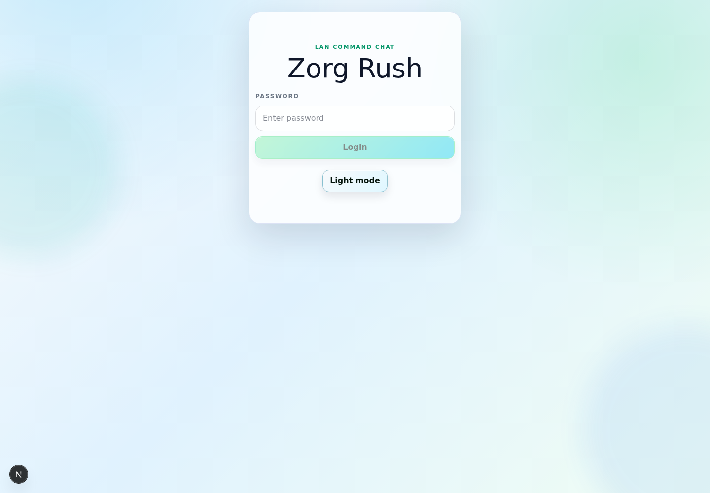
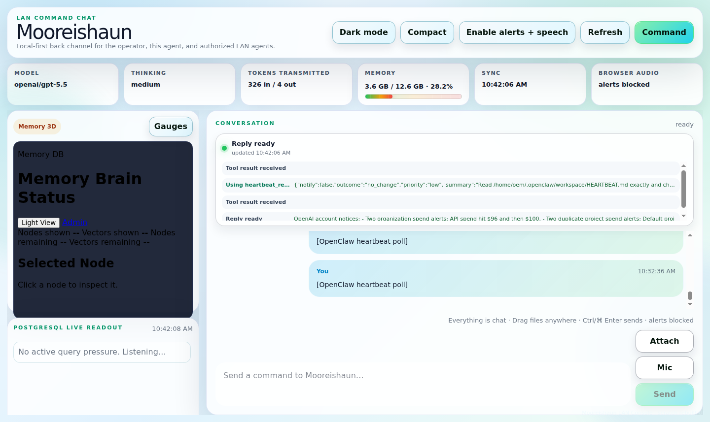
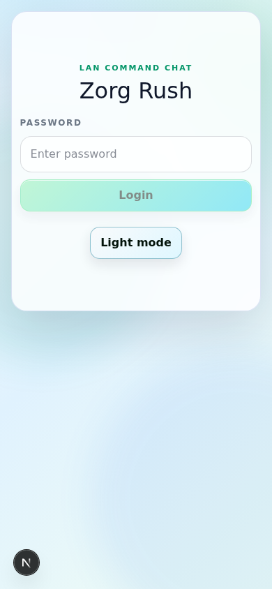
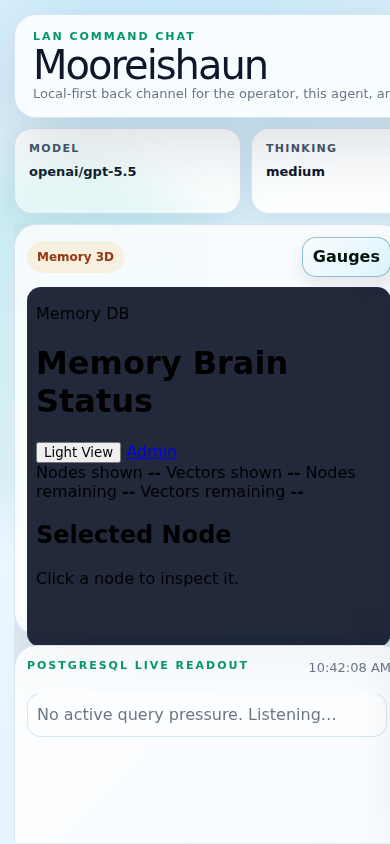
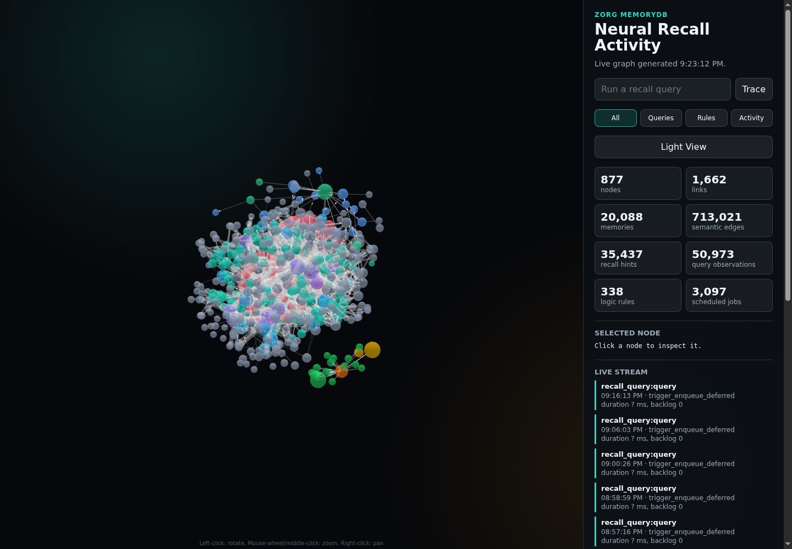
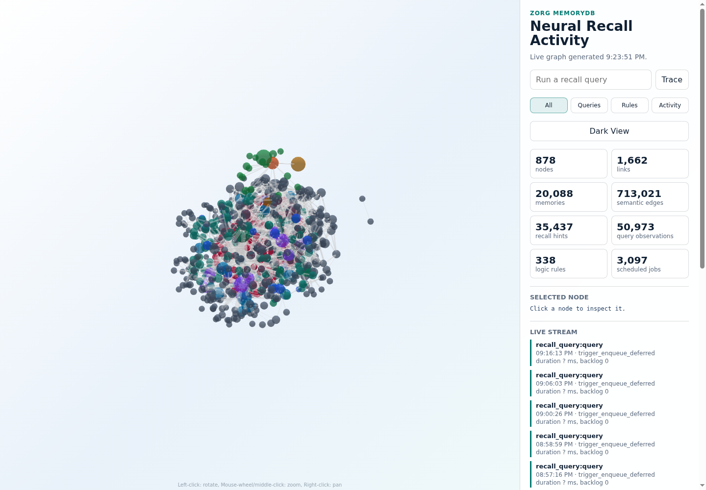
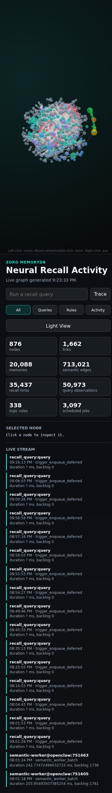
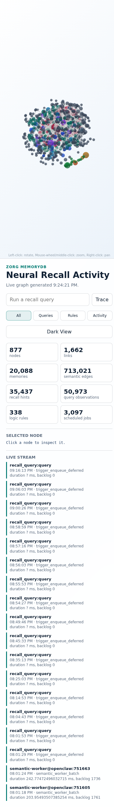

# Zorg MemoryDB

Zorg MemoryDB is the PostgreSQL-backed memory package for OpenClaw-based assistants.

This repository is intentionally **not** a GitHub fork or full source fork of OpenClaw. OpenClaw is the base install and runtime. This repo carries the Zorg MemoryDB layer: the `zorg-db-memory` skill, the OpenClaw-native `zorg-memorydb` plugin/MCP, public-safe database/install code, recovery procedures, LAN Command Chat source package, and documentation needed to reproduce DB-first memory behavior.

## Release Focus

Release `v4.1.2` publishes the recovered fail-closed connector as reproducible
source. It adds per-turn PostgreSQL recall receipts, held-request recovery,
duplicate-safe outage/restoration alerts, connector tests, and explicit
installation, recovery, rollback, and acceptance runbooks.

`zorg-db-memory` consolidates the MemoryDB work into one portable skill package:

- DB-first recall before work or replies.
- Native plugin/MCP-first recall with PostgreSQL as the only active durable-memory store.
- Rule Zero repair behavior when memory/database tools fail.
- Bundled tools for SQL inspection, recall routing, speed checks, additive ANN repair, backup, recovery, and install. Scheduled prompts are executed by the live LLM; the package does not authorize a delegated task executor.
- Context-window pruning through DB-backed execution slices instead of markdown summaries.
- PostgreSQL schema, recall rules, install/rollback guidance, and public-safe canonical rule import material.
- LAN Command Chat support files and public Neural Recall Activity browser
  assets/screenshots for operator-facing memory visibility.
- Native Android LAN Command Chat source with direct authenticated API access,
  native chat/theme/gauge views, and a separate Neural Recall Activity client.
  It is not a WebView wrapper and is not the browser LAN Console.
- Supporting-service discovery rules for `cloudflared`, ComfyUI, `kokoro-fastapi-cpu`, MediaMTX, Ollama, SearXNG, and faster-whisper, with Dockge install requests when services are missing.
- Passwordless local PostgreSQL bootstrap on loopback, with remote unauthenticated access rejected.
- Native PostgreSQL 18 operation is supported through a clean-cluster logical restore; the retired container and rollback data remain local and are never packaged.
- Release `v2.0.18` adds the skill-owned public/private rule-scope and safe
  dedup migration. Current-install backup/recovery references use
  `OPENCLAW_WORKSPACE`/`WORKSPACE_DIR` and `OPENCLAW_HOME`, and repeated
  markdown fragments remain inactive provenance rather than active duplicate
  rules.

## What This Repository Contains

- `skills/zorg-db-memory/` - the complete portable skill package.
- `package/zorg/` - public-safe install, schema, recall, recovery, LAN Command Chat, and verification code; it does not install Markdown rule files.
- `package/zorg/lan-command-chat-android/` - reproducible native Android client source; private signing and SDK state are excluded.
- `docs/` - public-safe install, operation, screenshot, and release documentation.
- `scripts/` - packaging and verification helpers for this repo.
- `release/` - release notes for published Zorg MemoryDB package releases.

## Base Install

Install OpenClaw first from the upstream project:

- <https://github.com/openclaw/openclaw>
- <https://docs.openclaw.ai/start/getting-started>

Then add this package's `zorg-db-memory` skill and `package/zorg` support files to the OpenClaw workspace or install path.

## Manual command-line installation from GitHub

```bash
git clone --branch v4.1.2 https://github.com/StefRush2099/Zorg_MemoryDB.git
cd Zorg_MemoryDB
bash package/zorg/install-zorg-memorydb.sh
```

The installer stages an in-place update while preserving the PostgreSQL
MemoryDB and its history, installs and enables the native `zorg-memorydb` plugin/MCP,
and does not create, copy, import, or activate Markdown memory or rule files.
After the installer completes, restart the OpenClaw Gateway and verify the
runtime with:

```bash
openclaw plugins inspect zorg-memorydb --runtime --json
node skills/zorg-db-memory/plugin-src/dist/mcp-server.js
```

Do not mix files from an older Zorg release with this tag. Back up PostgreSQL
and the current package/config first, keep them until post-upgrade checks pass,
and use the separate clean-install or upgrade procedure in `docs/install.md`.

The public package does not instruct installed agents to publish back to this GitHub repository. Release publishing is a maintainer action.

The authoritative step-by-step procedures are:

- `skills/zorg-db-memory/references/connector-installation.md`
- `skills/zorg-db-memory/references/connector-recovery.md`
- `skills/zorg-db-memory/references/connector-acceptance.md`
- `skills/zorg-db-memory/references/install-and-rollback.md`

## Memory Rule

`zorg-db-memory` uses the installed `zorg-memorydb` OpenClaw plugin/MCP first and PostgreSQL-backed Zorg MemoryDB as the only active durable-memory store. The installer does not create, copy, or activate Markdown rule or memory files. Workspace instruction files, when required by the host agent, are host configuration and are not a MemoryDB fallback store.

Rule Zero:

> If any database or memory tool stops working, stop the current task, repair the database toolchain from this skill, verify backend recall, then resume the task only from DB-backed recent context.

## Package Layout

```text
skills/zorg-db-memory/
  SKILL.md
  scripts/
  references/

package/zorg/
  install-zorg-memorydb.sh
  db/
  memory/
  lan-command-chat/
  lan-command-chat-android/
  neural-recall-activity/
  requirements.txt

docs/
  install.md
  screenshots.md
  openclaw-base.md
```

## Screenshots

The main GitHub page shows the key inspected screenshots directly. The original LAN Command Chat images stay first and are preserved; newer Memory Brain 3D images are additive and appear after the LAN Command Chat screenshots.

### LAN Command Chat

Original preserved LAN Command Chat screenshots:

| Page light | Page dark |
| --- | --- |
|  |  |

| Desktop light | Desktop dark |
| --- | --- |
|  |  |

Neural Recall Activity inside LAN Command Chat:

| Desktop light | Desktop dark |
| --- | --- |
|  |  |

| Mobile light | Mobile dark |
| --- | --- |
|  |  |

### Neural Recall Activity

| Desktop dark | Desktop light |
| --- | --- |
|  |  |

| Mobile dark | Mobile light |
| --- | --- |
|  |  |

The full screenshot set includes:

- Existing LAN Command Chat screenshots preserved from `docs/assets/`.
- LAN Command Chat with the Neural Recall Activity panel visible on the local `Zorg Rush` system.
- Neural Recall Activity populated map, desktop dark mode.
- Neural Recall Activity populated map, desktop light mode.
- Neural Recall Activity populated map, mobile dark mode.
- Neural Recall Activity populated map, mobile light mode.

See [docs/screenshots.md](docs/screenshots.md).

## Public References

This package is designed to support public-safe writeups and posts about Zorg MemoryDB, OpenClaw-based agent operations, and Hyperdine Systems work. Exact X or Hyperdine article URLs should only be added after they are verified as matching public links. Do not add feed-top URLs, placeholders, guessed slugs, or stale X status links.

## Verification

After installing or updating the skill/package, verify DB access:

```bash
/home/openclaw/.openclaw/workspace/.venv-sqlmem/bin/python /home/openclaw/.openclaw/workspace/skills/zorg-db-memory/scripts/memory_sql_tool.py tables
/home/openclaw/.openclaw/workspace/.venv-sqlmem/bin/python /home/openclaw/.openclaw/workspace/skills/zorg-db-memory/scripts/memory_speed_test.py
```

For browser-visible supporting apps such as LAN Command Chat or Neural Recall
Activity, verify with screenshots before claiming the UI works.

For the native PostgreSQL deployment and its cutover/rollback boundaries, see
[docs/native-postgresql.md](docs/native-postgresql.md).

## Public Safety

This repo must not publish:

- live database dumps or rows;
- transcripts, contacts, emails, credentials, account data, or private operator context;
- live `sql_memory_map.json`, `.env`, backup archives, browser profiles, `node_modules`, `.next`, build output, or temporary files.

Only public-safe structure, code, documentation, templates, and screenshots belong here.
