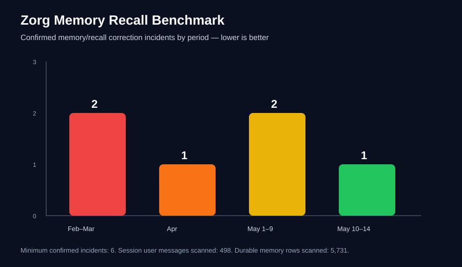

# Recall Failure Benchmark

Zorg MemoryDB treats recall failures as measurable system feedback. A recall failure is counted when a user correction or later verified evidence shows that the needed fact, access path, rule, or prior working process already existed in durable memory or available system state, but the assistant did not retrieve it before asking for more information, giving the wrong answer, or taking the wrong path.

This benchmark is intentionally conservative: it reports **minimum confirmed incidents**, not a claim that every historical failure was found. It avoids publishing private transcripts, credentials, contact data, live database rows, or sensitive infrastructure details.

## 2026-05-14 Snapshot

Public-safe aggregate scan results from one OpenClaw/Zorg deployment:

| Metric | Value |
|---|---:|
| Durable memory rows scanned | 5,731 |
| Session files scanned | 362 |
| Session messages scanned | 6,299 |
| User-role messages in session store | 498 |
| Confirmed memory/recall correction incidents | 6 minimum |
| Confirmed recall-correction rate vs stored user messages | 1.2% |
| Non-confirmed-failure rate vs stored user messages | 98.8% |

## Period Trend

| Period | Confirmed incidents | Public-safe interpretation |
|---|---:|---|
| Feb-Mar 2026 | 2 | Early recall leaned too much on logs and unstructured memory; important system facts were not always promoted into durable structured recall. |
| Apr 2026 | 1 | A shallow-miss pattern was identified and deeper backend recall rules were reinforced. |
| May 1-9 2026 | 2 | DB-only migration, contact/CRM recall, publication-rule enforcement, and recall hints improved coverage but exposed more measurable edge cases. |
| May 10-14 2026 | 1 | Rule capture became faster: corrections were stored as structured DB rules/facts soon after clarification. |

## Methodology

1. Search durable DB memory for correction phrases, recall-failure notes, explicit operator clarifications, and documented shallow misses.
2. Search session stores for assistant acknowledgments such as “you’re right,” “memory shows,” or equivalent correction language.
3. Count only incidents where the missing fact/process/rule was later verified in memory or durable state.
4. Treat the count as a lower bound if older transcripts were compacted, migrated, or unavailable.
5. Convert each confirmed miss into additive recall support: structured rules, aliases, project facts, relationship edges, recall hints, or benchmark queries.

## Why this matters

A memory-backed assistant should not merely apologize after forgetting. It should make forgetting harder next time. Zorg MemoryDB uses these incidents as training signals for the surrounding operating system: failures become structured recall tests and documentation updates instead of disappearing into chat history.

## Privacy Boundary

This public benchmark intentionally excludes private content. The repo receives only aggregate counts, public-safe methodology, and sanitized examples of failure categories. Private transcripts, contact records, credentials, operational secrets, and raw database rows remain out of the public repository.
