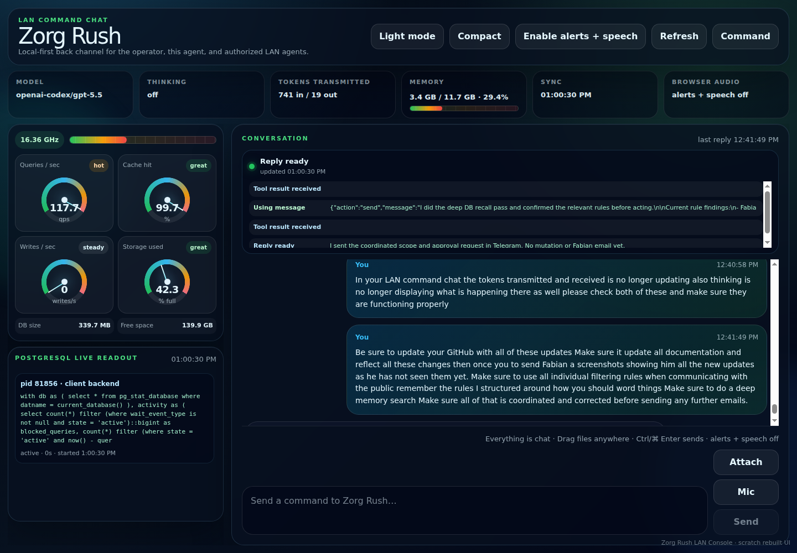
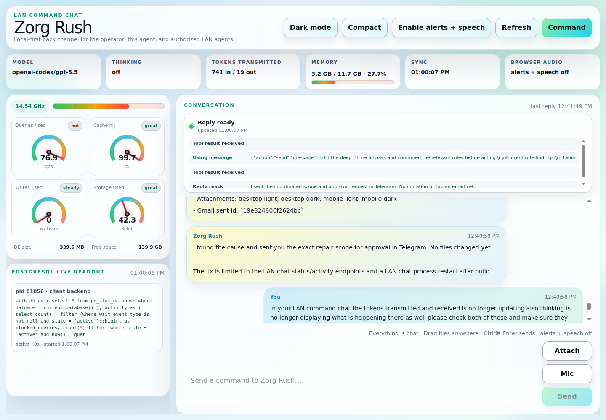

# Screenshots

The current public screenshot set documents the LAN Command Chat UI and the Neural Recall Activity map that support Zorg MemoryDB operations. These images are public-safe UI captures only; they do not include private transcripts, credentials, browser profiles, database dumps, or live database rows.

The Neural Recall Activity screenshots are additive and come after the LAN Command Chat screenshots. Existing LAN Command Chat screenshots remain available; the eight Neural Recall Activity captures below are the refreshed replacement set.

## LAN Command Chat

Original preserved LAN Command Chat screenshots:

Curated release screenshot copies:

Light page:

Dark page:

Light desktop:

Dark desktop:

Neural Recall Activity panel in LAN Command Chat, desktop light:

Neural Recall Activity panel in LAN Command Chat, desktop dark:

Neural Recall Activity panel in LAN Command Chat, mobile light crop:

Neural Recall Activity panel in LAN Command Chat, mobile dark crop:

## Neural Recall Activity

Desktop dark mode:

Desktop light mode:

Mobile dark mode:

Mobile light mode:

Runtime-private screenshots, internal IP screenshots, browser profiles, and local verification artifacts should not be committed unless they are intentionally sanitized for public documentation.
