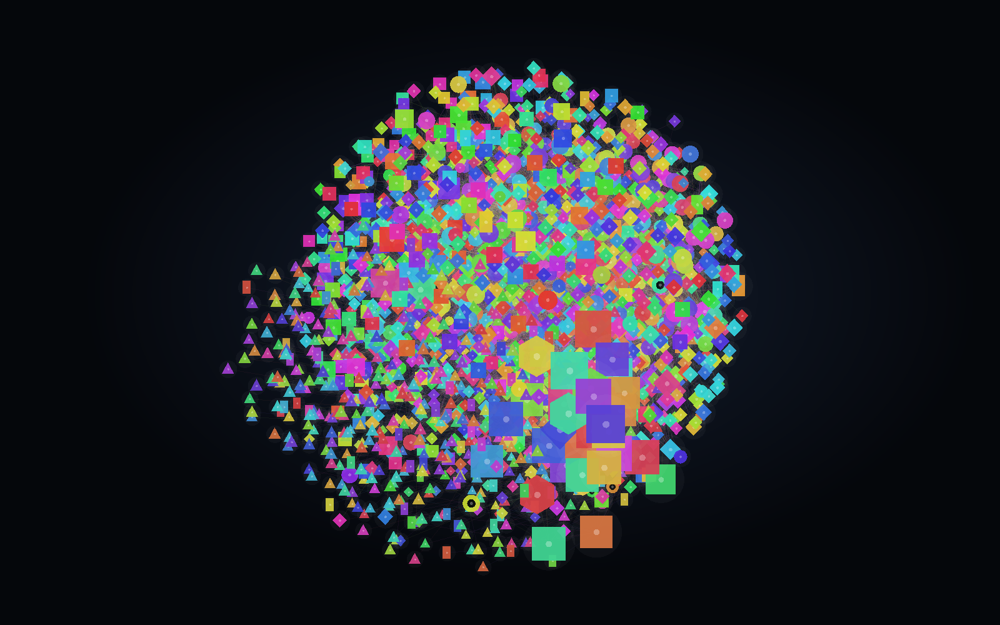
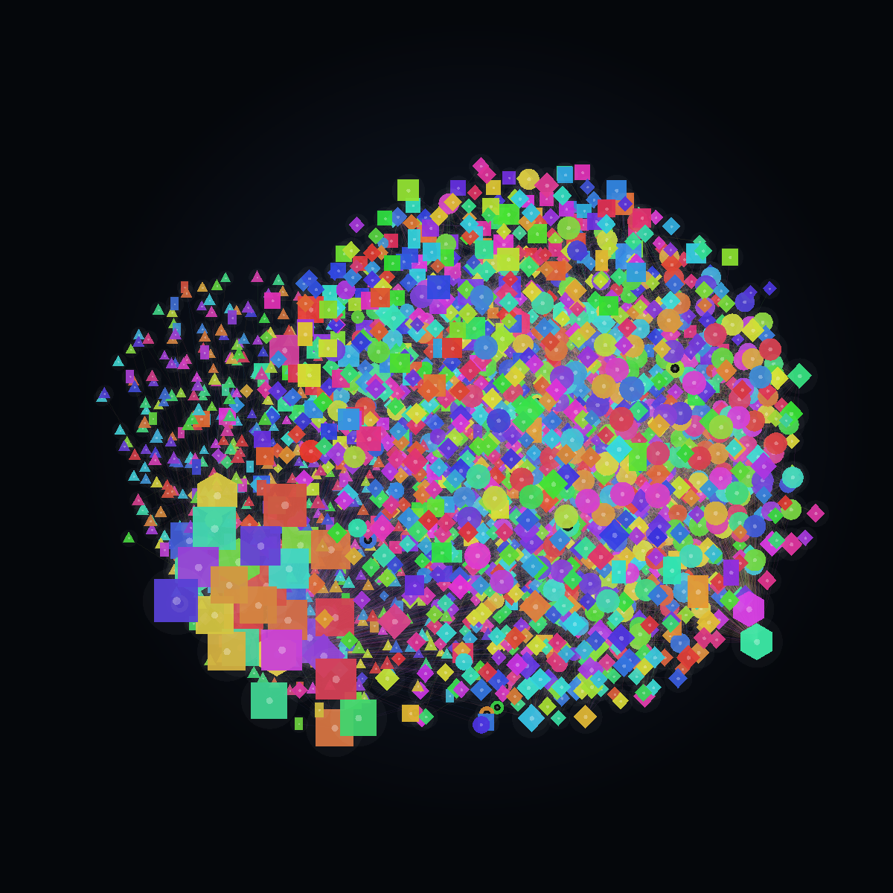
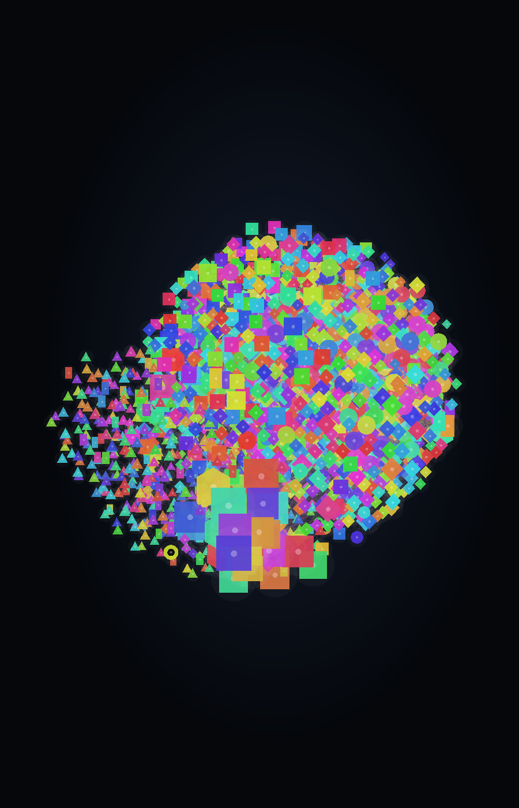

# Zorg Memory 3D Screenshots

These images were rendered from the live server-side Zorg Memory 3D engine state on 2026-07-02 after the v44 property-driven visual update.

The browser is not rebuilding the graph for these captures. The images use the engine's live node positions, vector connection counts, display scale values, property-driven color rules, and property-derived shape rules.

## 2026-07-02 v44 Live Cloud Map

Suggested Hyperdine article image paths:

- `/zorg-memory-3d/2026-07-02/zorg-memory-3d-v44-live-cloud-wide.png`
- `/zorg-memory-3d/2026-07-02/zorg-memory-3d-v44-live-cloud-square.png`
- `/zorg-memory-3d/2026-07-02/zorg-memory-3d-v44-live-cloud-portrait.png`
