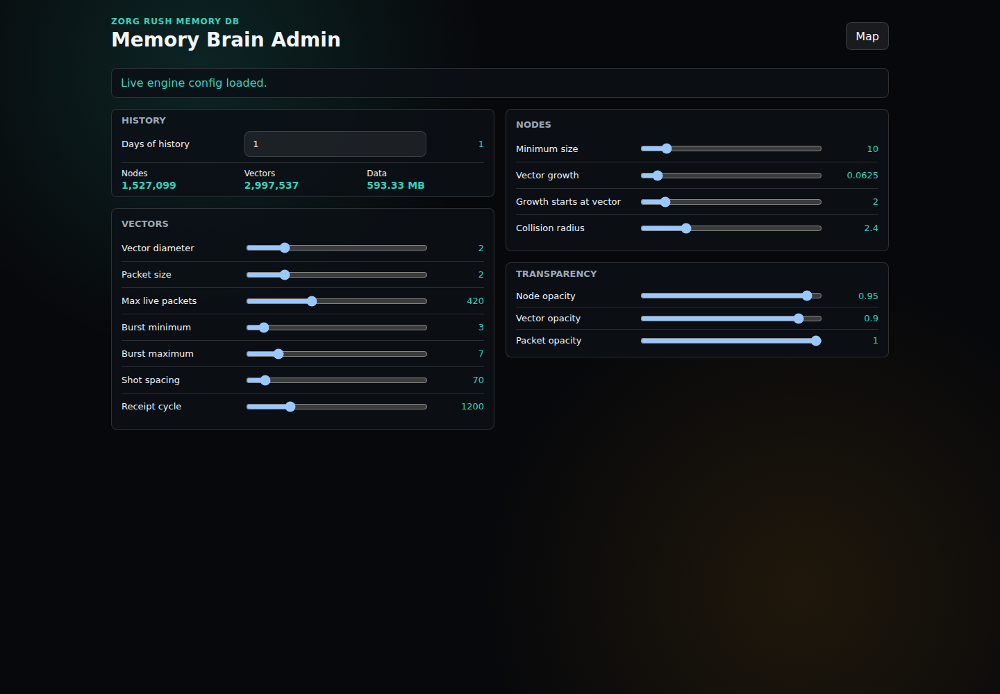

# Zorg Memory 3D Brain Map

Zorg Memory 3D is the built-in visual brain map for a Zorg MemoryDB install. It
turns PostgreSQL-backed memory, semantic nodes, recall hints, relationships,
runtime events, and rule activity into an interactive 3D graph so an operator can
inspect how the assistant's memory is connected instead of reading database rows
one table at a time.

Default native URL:

```text
http://127.0.0.1:8097/
```

Default ADMIN URL:

```text
http://127.0.0.1:8097/admin
```




## What It Is Used For

- Seeing MemoryDB as an active 3D relationship map.
- Inspecting how semantic nodes, recall hints, memory relationships, and runtime
  events connect to each other.
- Checking whether recent memory activity is entering the graph.
- Demonstrating that Zorg MemoryDB is more than flat recall: it has visual,
  data-backed structure that can be explored.
- Tuning the live map through the ADMIN page without editing code.

## ADMIN Page

The ADMIN page adjusts runtime graph settings through the local
`/api/game/config` endpoint. The current controls include:

- history window size
- minimum node size
- vector growth
- collision radius
- vector diameter
- packet size
- maximum live packets
- packet burst behavior
- node, vector, and packet opacity

The page also estimates how much data the selected history window will load,
showing node count, vector count, and approximate data size before the operator
expands the graph window.

## Native Standard Install

The standard Ubuntu installer copies `zorg-memory-3d/` into the OpenClaw
workspace, installs its npm dependencies, and registers a user-level service:

```bash
systemctl --user status zorg-memory-3d.service
```

The service runs as a native Node.js process. It is not a Docker container in
the Standard Ubuntu install path.

## Verification

After install, verify the service and both pages:

```bash
curl -fsS http://127.0.0.1:8097/api/health
curl -fsS http://127.0.0.1:8097/ | grep -i 'Memory Brain'
curl -fsS http://127.0.0.1:8097/admin | grep -i 'Memory Brain Admin'
```

To verify ADMIN settings can be adjusted, change a small value on the ADMIN
page and confirm it saves, then restore the original value.
